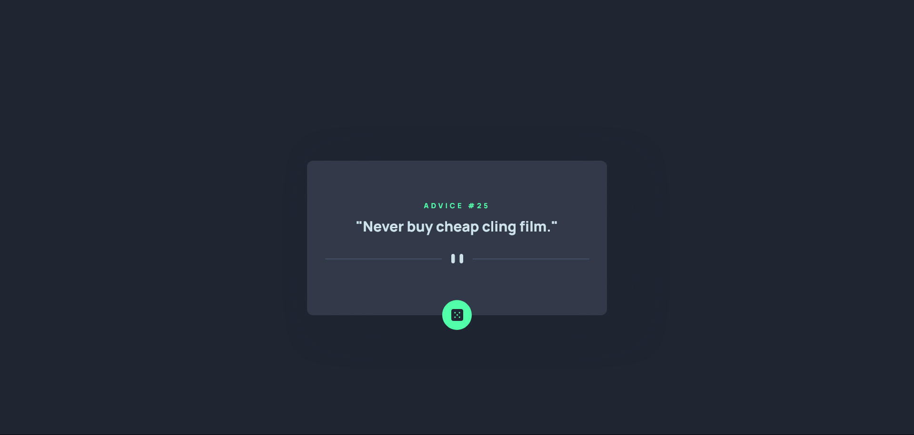

# Frontend Mentor - Advice generator app solution

This is a solution to the [Advice Generator App](https://www.frontendmentor.io/challenges/advice-generator-app-QdUG-13db). Frontend Mentor challenges help you improve your coding skills by building realistic projects.

## Table of contents

- [Frontend Mentor - Advice generator app solution](#frontend-mentor---advice-generator-app-solution)
  - [Table of contents](#table-of-contents)
  - [Overview](#overview)
    - [The challenge](#the-challenge)
    - [Screenshot](#screenshot)
    - [Links](#links)
  - [My process](#my-process)
    - [Built with](#built-with)
    - [What I learnt](#what-i-learnt)
  - [Author](#author)

## Overview

### The challenge

Users should be able to:

- View the optimal layout for the app depending on their device's screen size
- See hover states for all interactive elements on the page
- Generate a new piece of advice by clicking the dice icon

### Screenshot



### Links

- Solution URL: [Add solution URL here](https://advice-generator-fem.shashankbhat.co.in/)
- Live Site URL: [Add live site URL here](https://github.com/shashankbhat2/advice-generator-fem)

## My process

### Built with

- Semantic HTML5 markup
- CSS custom properties
- Flexbox
- Vanilla Javascript

### What I learnt

I implemented an IIFE (Immediately Invoked Function Expression) for the javascript code. This made me understand how they work and how js function scoping works. I also learnt the basics CSS Keyframe Animations.

```html
<div class="card">
  <small class="text_small" id="advice_number">Advice #</small>
  <h2 class="text_content" id="advice_content">
    "It is easy to sit up and take notice, what's difficult is getting up and
    taking action"
  </h2>
  
  
  <div class="circle" id="advice_circle">
    
  </div>
</div>
```

```css
@keyframes rotate {
    50% {transform: rotate(180deg);}
}
```
```js
 adviceCircle.addEventListener("click", () => {
    dice.classList.add("rotate");
    generateAdvice();
    setTimeout(function () {
      dice.classList.remove("rotate"); 
    }, 1000);
  });
```

## Author

- Website - [Shashank Bhat](https://shashankbhat.co.in/)
- Frontend Mentor - [@shashankbhat2](https://www.frontendmentor.io/profile/shashankbhat2)
